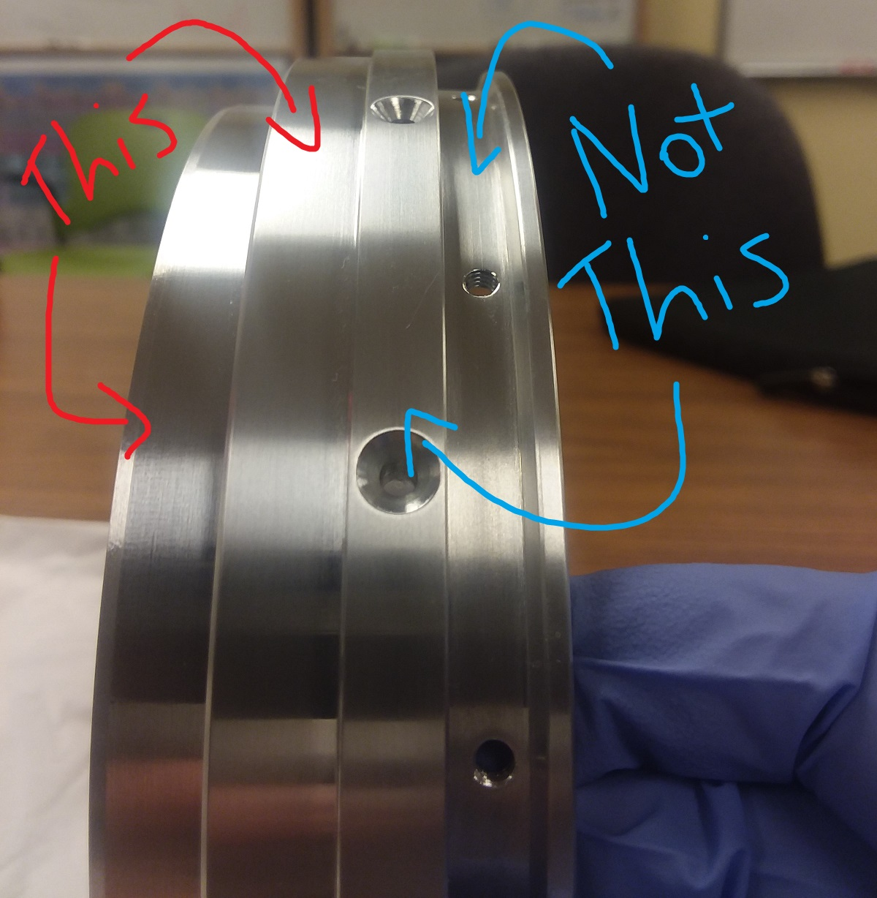
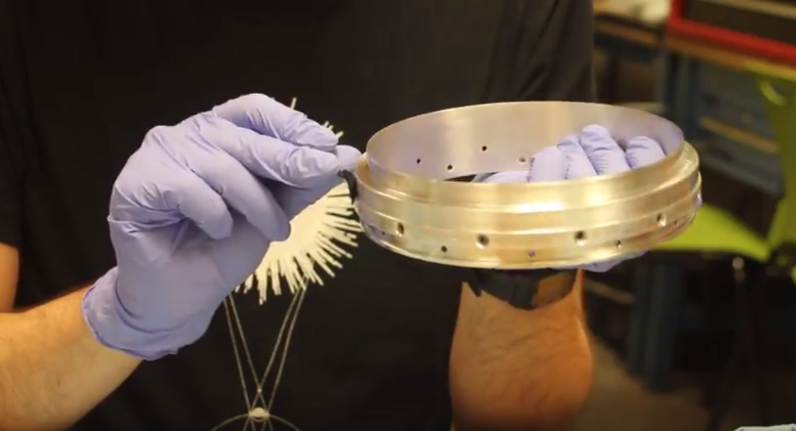
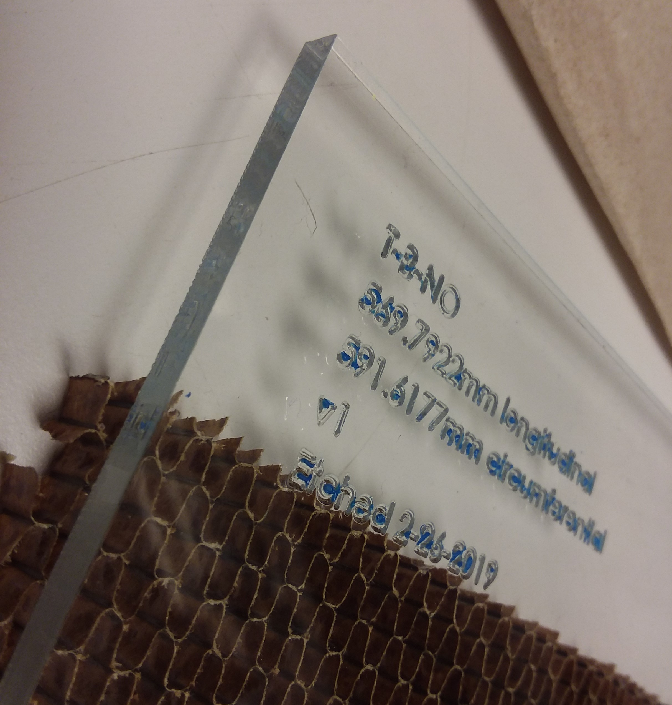
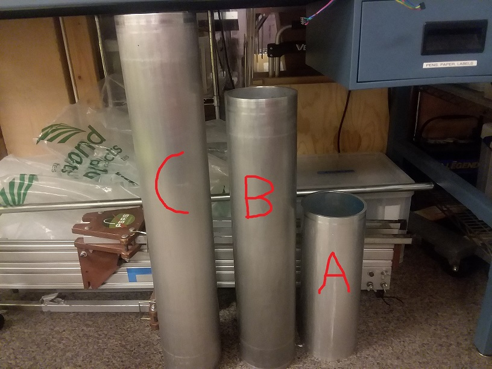
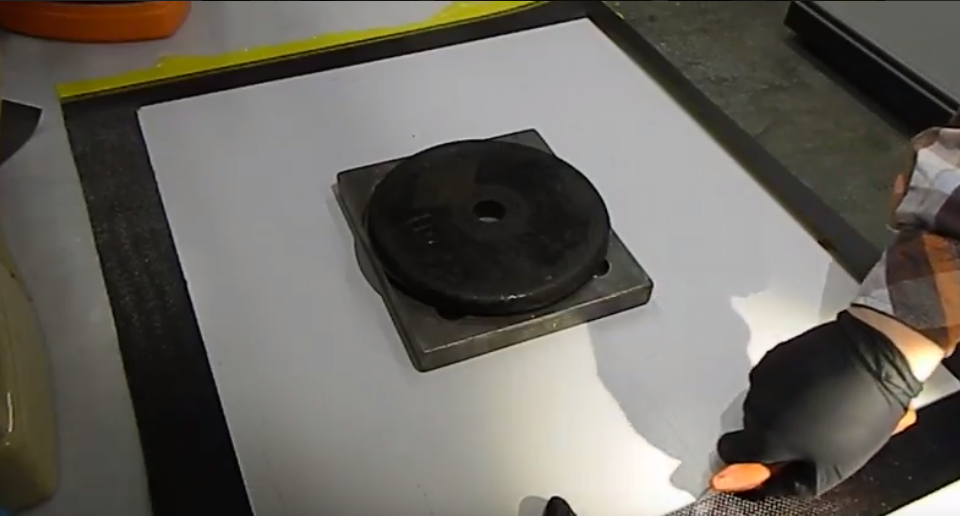
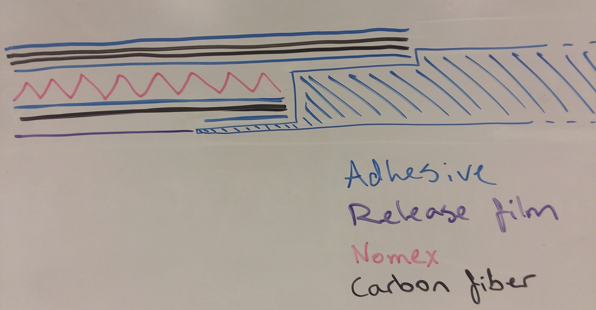
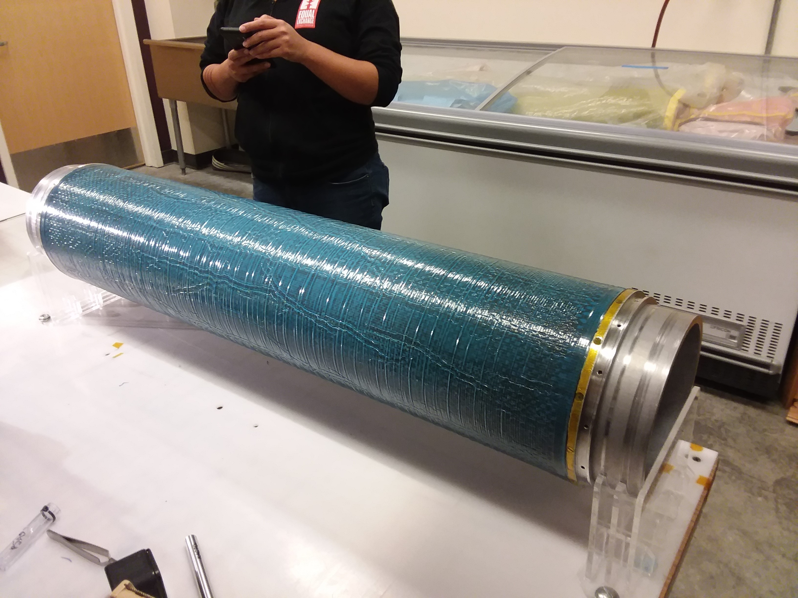

# Introduction
This is the procedure to make a cylindrical module specifically for the Launch Vehicle (LV) 3.1. If you find any steps that are unclear, erroneous, unneccessary, or need improvement, please [add an issue for it on this repo](https://github.com/psas/lv3.1-airframe/issues).

This procedure takes about 5 hours if you have three people working on it, not counting the 5 hour cure cycle. If you're following this procedure for the first time, it will probably be closer to 7 or 8 hours. If you *really* know what you're doing, one person can do it, but it's not nice to make one person work for 10 hours straight. If you're trying modifications to this procedure, it's a good idea to do so on a smaller mandrel with no coupling rings, since that takes off a lot of the time.

The composites training video can be found [here](https://youtube.com), and it goes over the process of making these modules. If this is your first time following this procedure, please watch the video first.

## Materials
### Consumables
1. [Orca skin](http://www.fiberlay.com/upload/techd-2522041-252204_OrcaSkin_Data.pdf)
1. [Orca seal](http://www.fiberlay.com/upload/techd-252203-252203_OrcaSeal_Data.pdf)
1. Shrink tape
1. Non-perforated release film
1. Vacuum bag sheets
1. Vacuum bagging tape ("goop tape")
1. Vacuum bagging breather material
1. 320 grit sandpaper
1. 600 grit sandpaper
1. 1500 grit sandpaper
1. Acetone
1. Powderless nitrile gloves
1. Blue shop towels
1. Kapton tape or flash tape
1. 1 whole 3M AC-130 pre-treatment solution
1. Separation wax

### Layup Pieces
1. Prepreg carbon fiber (Satin weave is preferable. Anything but unidirectional will do. We use Cytec BMS-8-297 3K-70-PW TY4 CL2, which is the big yellow roll in the EB 480 freezer.)
1. Structural adhesive (We use Cytec's Meltbond 1515-3M, which bonds to CF, nomex, and aluminum. We know that 3M's AF-126 DOES NOT WORK.)
1. Two (Generation 2) Aluminum Coupling Rings
1. 12 aluminum coupling ring arc clamps
1. 1/4" thick over-expanded nomex honeycomb
1. An aluminum mandrel (6.0" OD!)

### Tools
1. Vacuum pump (we use a venturi pump)
1. Air hose
1. Insulated gloves (gardening gloves will work)
1. Utility knife
1. XActo knife (Optional, but helpful for finer trimming.)
1. Scissors
1. Mandrel-to-ring screws (size)
1. A small piece of acrylic (Popsicle sticks will work as well, albeit more difficult)
1. Material templates and weights

# Preparation
The following steps can be done in parallel. If you have the space and the people, this is recommended to save time.
## Mandrel Preparation
#### Mandrel Cleaning
1. Put on powderless nitrile gloves.
1. Use a piece of acrylic or a popsicle stick to scrape away any chunks of epoxy or adhesive currently on the mandrel from the previous layup.
1. Wet sand the mandrel with 320 grit paper to remove the epoxy and adhesive from the previous layup.
1. Wet sand the mandrel with 600 grit paper, removing the marks from the previous sanding.
  1. The sanding direction can be alternated (that is, axial v.s. radial) to better identify any spots that were missed, but this is optional.
1. Wet sand the mandrel with 1500 grit paper, removing the marks from the previous sanding. You want the mandrel to be as smooth as possible before continuing.
1. Put on fresh (as in change to a new pair) powderless nitrile gloves.
1. Wipe the mandrel with acetone and a blue shop towel to clear the sanded epoxy and metal dust until the towel comes back clean.
1. Relocate the mandrel and the composites table to a space with good ventilation. We normally use a spot on the north end of the first floor of EB where there is a set of double doors for ventilation.

#### Mandrel Conditioning
The figure below shows the waxed mandrel along with a container of Orca skin and Orca wax. This should be done in an area with good ventilation because the wax chemicals are very potent.

1. Put on (Brand new!) powderless nitrile gloves.
1. Place the freshly sanded mandrel to be conditioned on the mandrel holders.
1. Fill mandrel threaded holes with separation wax.
1. Apply 2 coats of Orca Seal. For each coat, complete the following:
   1. Shake the container of Orca seal to mix the wax and then unscrew the lid.
   1. Apply some Orca seal to a blue shop towel by *carefully* covering the opening of the container and briefly inverting.
   1. As lightly as you can and as evenly as you can wipe the wax onto the mandrel. Usually the first wiping motion of the towel will be thick and visible on the mandrel; this is common. If you are able to more evenly distribute the thicker streak, do so, otherwise it will be fine.
   1. If there are any chunks of wax, carefully remove them with a shop towel.
   1. Let the coat of wax dry a little before procedding with the next coat. This drying process can be sped up with a heat gun.
1. Apply 7 coats of Orca skin the same way, with 10 minutes between coats. This process can be sped up with a heat gun, but you want to make sure the previous coat is as dry as possible, otherwise the wax will streak when you try to work with it.
1. Wait approximately 1 hour for the wax to completely dry and set.

## Coupling Ring Preparation
#### Coupling Ring Cleaning and Deoxidization
1. Put on powderless nitrile gloves.
1. Wet sand the adhering surfaces of the rings with 320 grit paper (3 passes circumferentially).
1. Put on fresh powderless nitrile gloves.
1. Clean all surfaces with acetone and a blue shop towel to remove metal shavings.
   1. We change gloves before this step to prevent any dust that stuck to the gloves from falling back onto the mandrel.

#### Coupling Ring Conditioning
1. Put on fresh powderless nitrile gloves.
1. Mix the 3M AC-130 pre-treatment solution according to the instructions within the kit.
1. Continuously apply the anti-galvanic 3M AC-130 to the adhering surfaces for 3 minutes with a brush (like a watercolor painter, slowly rotating around the whole adhering surfaces-- but do so for 3 minutes, rather than a certain number of rotations).
1. Take care not to touch the adhering surfaces from this point on because it will contaminate the anti-galvanic and you will have to re-apply it.
1. Wait for 10 minutes to allow the solution to dry.
1. Put on fresh powderless nitrile gloves.
1. Apply the anti-galvanic solution again.
1. Relocate the composites table and the rings to a well-ventilated area if it has not been already.
   1. It may be worth waiting until everything is ready to be waxed before moving the table. This reduces risk of dropping or damaging the rings while moving by hand.
1. Wait for 60 minutes to allow for everything to dry.
1. Apply 1 coat of Orca seal to the innermost surface using the same method as with the mandrel.
1. Apply 3 coats of Orca skin to the innermost surface, waiting 10 minutes between coats.
1. Wait for 60 minutes.

**IMPORTANT: _If the adhering surface of the rings is disturbed, it will affect the performance of the completed module, so take care to avoid touching these areas because you will have to clean the adhering surface and re-galvanize it._**

## Cutting Films and Fabrics
These steps are best done in advance or while you are waiting for the anti-galvanic juice to chooch and the final layer of mold release to dry.

#### Pieces to Cut:

Cut the following layers using the General Template Use instructions below. The format for the templates is:

[Template]-[Size]-[Layer Identifier]

The size part of the code refers to the mandrel you are using. The "X" is to be replaced with A, B, or C, where A is the smallest mandrel (image below). The layer identifier indicates if the piece is:
1. An inner or outer layup piece (I or O)
1. The material being cut (C for carbon fiber/adhesive, NO for nomex)

The materials that need to be cut are:

| T-X-IC | T-X-OC | T-X-NO |
|--------|--------|--------|
| Inner Release Film\* | Mid Adhesive | Nomex |
| Inner Carbon Fiber | Outer Carbon Fiber A | |
| Inner Adhesive | Outer Carbon Fiber B | |
| | Outer Adhesive | |
| | Outer Release Film\** | |

\*- Remove 3/4 inches from length 
\**- Add 3 inches to length

  
  

It will be useful to label each of these parts so you don't accidentally place the wrong layer in the wrong spot during the layup process. You can write which layer it is in Sharpie on the protective backing of the layers.

Additionally:

1. Cut two strips of adhesive with dimensions 1/4" by 20" to apply to each coupling ring. Make sure they are no wider than 1/4".
   1. This can easily be done by placing the edge of a template on a straight-cut piece of adhesive and using the depth gauge of a pair of calipers to tweak and check the width of a strip.

#### General Template Use

1. Select the appropriate template for the desired film or fabric using the table above.
1. Lay the film or fabric over the plastic surface of the work bench.
1. Place the template over the film or fabric.
   1. When cutting the overexpanded nomex honeycomb core material, make sure the template is oriented correctly! The overexpanded cells only bend in one direction. Make sure the template is oriented such that the nomex will be able to bend around the cylinder.
   1. You should only be cutting single rows of cells (don't cross from one row to another).

Nomex Bending the Right Way | Nomex Bending the Wrong Way
:---:|:---:
  | 

1. To cut the carbon fiber, it works well to place the corner of the template on the corner of one of the cells (you will have to remove one of the layers of peel ply). The template can then be rotated such that it perfectly lines up with the rows and columns of the fabric. NOTE: this doesn't work with fiberglass.
   1. Make sure the area being cut does not intersect bad portions of the CF.
1. While one person moderately presses down on the template, another person should cut along the edges with a utility knife, pressing hard enough to cut through the material.
   1. It also works well to place weights on the templates while cutting, especially when cutting the adhesive and if you are working by yourself.
1. Lift up the outside portion of the cut before removing the template to check that the cut is complete. If it isn't, slice the remaining material.

# Assembly
These steps must be done in series. The layup table really only accomodates 2 or 3 people, so just switch out people as appropriate.

## Step 1: Hardware Assembly &amp; Final Conditioning
What follows is the general procedure for assembling all prepared pieces.

**_IMPORTANT: If the adhering surface of the rings is disturbed, it will affect the performance of the completed module. Take care to avoid touching these areas because you will have to clean the adhering surface and re-apply the anti-galvanic treatment._**

1. Put on fresh powderless nitrile gloves.
1. Without touching the waxed surface of the mandrel, slide the coupling rings onto the mandrel.
1. Screw the coupling rings to the mandrel. It works best to place the mandrel upright with one person sliding down the coupling ring from the top and another person fastening the screws.
1. Place the mandrel onto the mandrel holders.
1. Place the arc clamps on the connecting side of the rings, 6 on each ring, and secure with kapton tape.

  
   1. The easiest way to do this is by placing an arc clamp in position and taping it to the previous arc clamp, but if there is an easier way for you, then do that.
   1. Put a couple of screws in the bracket holes to keep the ring of brackets in place. This comes in handy later.
1. Cover all the screw heads with kapton tape. This will prevent the epoxy or adhesive from flowing into them. Make sure the tape is as secure as possible; this can be done by covering the screw heads with more than one layer of tape.

## Step 2: Layer Layup (L2)

**_IMPORTANT: Each layer you apply will overlap itself. Try to make sure the overlapping sections of each layer is in a different location. Make sure consecutive layers have at least 90 degrees of separation between their overlap regions (basically, don't start each layer in the same spot)._**

We will be using the **Special Peel Technique** for each of the materials that has a protective peel ply layer on it. Note that this applies _after_ the material has been wrapped onto the mandrel. This ensures that the material (CF or adhesive) does not fall off by accident while removing the protective layer, as well as prevents the material from falling off the mandrel and ruining it with debris. This technique is:

1. Peel the overlapping section of the adhesive back _off_ of the mandrel while someone holds the underlapping end secure. This is to make room for the next step.
1. Start peeling the protective backing, starting from the underlapping end and proceeding circumferentially.
1. Roll the overlapping end back onto the mandrel.

The order proceeds as follows:

##### Release Film:
1. Wrap the Mandrel with the inner release film piece. It should span the entire molding surface of the mandrel and either not overlap with the coupling rings, or be tucked under the knife-edge of the rings. This is to prevent the module from sticking to the mandrel, but we want it to stick to the rings!

##### Adhesive Strips:
1. Lay the adhesive strips onto the lower adhering surface of each coupling ring (aka the knife edge). Make sure the strips are no wider than 1/4". The extra 1/8" of flange is to prevent the adhesive from flowing into the mandrel when hot.

##### Inner Carbon Fiber:
1. Remove one of the protective backing layers from the inner carbon fiber layer piece.
1. Lay this CF piece onto the mandrel, exposed side down. It should cover the release film and overlap the adhesive strips completely, butting up flush against the step of the rings (see below). The CF should overlap itself by about an inch. Don't worry too much about small wrinkles, they will be automatically smoothed during the cure cycle, but do try to smooth larger wrinkles and folds. _Do not tug or pull on the CF in an attempt to remove wrinkles._ If you need to remove large wrinkles, re-lay the CF instead.
1. Peel the remaining protective peel ply backing from the CF using the **Special Peel Technique**.

##### Innermost Adhesive Layer:
1. Peel the _paper_ protective layer from the inner adhesive layer piece.
1. Lay this inner adhesive piece over the CF, exposed side down. Rotate the mandrel while someone holds down the underlapping end.
1. Peel the remaining orange peel ply backing from the adhesive using the **Special Peel Technique**.

##### Nomex Layer:
1. Lay the overexpanded nomex honeycomb core over the mandrel. It works best to start at the seam (_not_ the ring edge) so the cell compression is more evenly distributed. Use a heat gun to tack the seam of the nomex into the underlying adhesive.
1. Firmly press the nomex into the adhesive. Be careful not to overheat the nomex; if it starts to notiseably warp, it's warm enough, and if it starts to darken, you got it too hot.
1. Go to the side of the nomex opposite the tacked part and use a heat gun to secure that end. You should have bowing on the untacked sides, like a bean.
1. Tack the remaining sides and make sure there are no "bubbles," aka untacked areas, in the nomex layer,

##### Mid Adhesive Layer:
1. With the nomex now affixed to the inner adhesive layer, remove the paper backing from the next piece of adhesive film.
1. Lay this next piece up over the nomex, with the newly exposed side facing inward, and rotate the mandrel while someone holds down the underlapping end.
1. Peel the remaining protective backing from the adhesive using the **Special Peel Technique** and ensure the adhesive layer is tight around the nomex.
1. If the adhesive layer is not sticking:
   1. Secure it with kapton tape. This can be done by folding the end of a piece of kapton tape into itself to create an easy-peel tab. Place the kapton tape so that the easy-peel tab is on the overlapping side, transitioning to the underlapping side.
   1. Hit it (very) lightly with a heat gun. **Avoid the part with the kapton tape!**
   1. **Do not touch the adhesive until it is cool!** Wait at least 15 minutes before handling it, otherwise it will stick to your gloves.
   1. Remove the kapton tape after the adhesive is solid again.

##### First Outer CF Layer:
1. Remove one of the protective backing layers from the first outer carbon fiber piece.
1. Lay this CF piece into the mandrel. Take care not to tug on the carbon fiber; the shrink tape will remove any wrinkles better than you can. Take care that the material does not extend over the lip of the coupling rings.
1. Use the **Special Peel Technique** to peel the remaining protective backing off of this CF layer.

##### Second Outer CF Layer:
1. Remove one of the protective backing layers from the second outer carbon fiber layer piece.
1. Lay this CF piece into the mandrel. Like with the other pieces of carbon fiber, do not tug on or pull the material, and make sure that the material does not extend over the lip of the coupling rings.
1. Use the **Special Peel Technique** to peel the remaining protective backing off of this layer of carbon fiber.

##### Outermost Adhesive Layer:
1. Peel the _paper_ protective layer from the outer adhesive layer piece.
1. Lay this newly exposed surface against the carbon fiber layer. Rotate the mandrel while someone holds down the underlapping end. Take care that it does not extend over the lip of the coupling rings.
1. Peel the remaining protective backing from the adhesive using the **Special Peel Technique**.

##### Outer Release Film:
1. Wrap the entire layup with the outer release film piece. This is to precent the module from sticking to the vacuum bags and shrink tape.
1. **IMPORTANT:** If the shrink tape you are using has release coating on it, apply the outer release film OVER the shrink tape (which is applied in the enxt step). This will result in a better surface finish. Double check whether the shrink tape has a release compound on both sides or just on one, and make sure the side with release compound faces inward toward the previous layer.

## Step 3: Shrink Tape
1. Arrange the shrink tape on a spool so that the outer surface may be easily applied to the layup (underhand from the spool; overhand onto the layup). This setup puts the mandrel between you and the spool.
1. Set up a workbench lamp such that it illuminates the layup.
1. Use kapton tape to fix the shrink tape into the arc clamps. Use lots of tape to fix them in place (one suggestion is to do 2-3 loops around the rings with tape). If it comes loose, the layup will be ruined. If the arc clamps are secured well, they will serve as a strong anchor for the shrink tape.

1. Use your dominant hand to tension the shrink tape against the layup.
1. Use your off hand to rotate the layup, wrapping the shrink tape around it. If you are working in groups, one person can rotate the mandrel while the other applies the tape. In this case, the off hand can be used to ensure the tape applies evenly.
1. Adjust the position of your dominant hand such that each turn of the shrink tape overlaps the previous one by 75% (one quarter offset). This should result in the appearance that the surface is covered in a single sheet of double-thick shrink tape. If there are any gaps or triple-overlaps, you must roll the layup backwards and redo those sections. You are basically trying to align the edges of the shrink tape together. Defects due to misalignment of the shrink tape will result in ribbing in the final product.
    
   1. Note: there will be ribbing regardless of what you do, but this step minimizes how prominent that ribbing is.
1. Every 3 or 4 rotations, add a piece of kapton or flash tape to save your progress, and adjust the positions of the lamp and tape spool to your convenience as you go. The lamp is used to illuminate the are where you are working and make the overlapping process easier to see.
1. When you reach the end of the opposite coupling ring, repeat the wrapping process until you end up back where you started (basically go down and back the length of the module). This will create a double layer of shrink tape.
1. Cut the shrink tape and securely fix it to the ring of clamps using kapton or flash tape.
1. Add 3 strips of kapton or flash tape that span the entire length of the module to fix the shrink tape against nudges during the vacuum bagging process.
1. If you are using perforated shrink tape, add a layer of non-perforated rerlease film to the outside of the layup, using kapton or flash tape to hold it in place.
   1. If you don't do this, the module will end up with "goosebumps," which make the shrink tape much harder to remove and the module much harder to sand.

## Vacuum Bagging
After adding the finaly layer of release film, the layup is ready to be vacuum bagged. An image of how the module should look at this point is provided below. Mandrel holders are not requires after the shrink tape has been applied. This part is done in the room with the oven.

**Note:** If you are freezing the module to cure for another time, follow the process below up to step 9. Seal all but a couple inches of one end to allow access for the vacuum hose.

1. Lay the breather material ("diaper") over the mandrel.
1. Secure the breather material with either kapton tape or flash tape. Note that this tape sometimes does not like to adhere to the breather material, so use longer strips of tape to keep the material in place. If there is extra breather material, it can be trimmed or tucked into the ends of the mandrel.
1. Cut the vacuum bag material to the size of your mandrel. It is better to be larger than the mdule and trim down later. Note that the vacuum bag material has two layers; these layers can be separated after the material is cut.
   1. **Important:** Both sheets of vacuum bag material need to be the same size. If you try to make one bag smaller, it will be _extremely_ difficult to tape the ends together. It has been tried, 0/10 would recommend.
1. Form two tubes that are 7-8 inches in diameter using the following process:
   1. Join the longer seams of the vacuum bag sheet together using the yellow vacuum bag tape ("goop tape"). This tube should be longer than the mandrel by at least 12 inches on both sides. Again, you can always trim down later.
   1. Gently pinch any air channels out of the goop tape. This can be done by holding the air channel between two fingers and wiggling the material back and forth until the goop tape fills the gap.
   1. You should have two separate tubes, each with two open ends and a sealed long edge.
1. With the mandrel on its side, take one of the tubes and push it through the inside of the mandrel. Set the mandrel upright and pull the second tube over the outside of the mandrel.
1. Place the mandrel back on its side to center the bags around the mandrel. The next step will be easier if the seams of the tubes are not aligned.
1. Using the goop tape, seal one end of the inner tube to the corresponding end of the outer tube. If the vacuum bag material is the same size, this step should not be difficult, but if they are different sizes then you will have to make sure the extra length is sealed off.
1. Take care that there is no air channel formed by the overlap of the outer tube with tiself. Pinch out channels with the same process as earlier. *Everybody makes this mistake at least once!*

1. Gently pinch any air bubbles or air channels out of the goop tape. This is mentioned again because it's very important.
   1. If you are freezing your module, leave room for the vacuum pump to go into the bag before wrapping the module in plastic and relocating to the freezer.
1. Cover the end of the vacuum hose with diaper material, securing it with kapton or flash tape.
1. Place the diaper end of the vacuum hose between the vacuum bag layers and near the coupling ring.
1. Carefully apply goop tape to the vacuum hose so that it may be sealed with the tubes.
1. Seal the open end of the tubes with the same process as before, and take special care to make sure the hose and tubes form a complete seal. Make sure there is no air channel formed by the overlap of the outer tube with itself.

# Curing
## Cooking
This part of the procedure can only be done in EB 480 or otherwise with an oven that reaches high temperatures.

1. Thread the vacuum hose through the hole in the oven wall.
1. Gently place the mandrel near the oven. Avoid carrying it by the module that you just assembled, because this can warp the final product; instead, carry it by the mandrel ends.
1. Attach the outside end of the vacuum hose to the venturi pump. It should already be attached to a compressed air supply, but if it isn't, then attach it.
1. While slowly turning on the compressed air supply, check the bag for hissing (this indicates a leak which must be sealed with goop tape). If the module is kept outside the oven, it is easier to move around to listen for leaks.
1. When the bag is no longer showing signs of air escaping, turn the air supply on completely and set the module inside the oven. Try to get it as horizontal as you can, but if it leans diagonally this will be ok.
1. Close and latch the oven.
1. Make sure the oven is plugged into two separate circuit breakers.
1. Make sure both relays on the side of the oven are in the “on” position. When this is done, you are ready to follow the instructions taped to the oven (image provided below).
1. Ramp up the the oven at 3°F per minute until it reaches 350°F.
1. Place the snorkels/fume hoods above the oven, open all the doors of the room, and place a fan in at least one doorway.
1. After it reaches 350°F, hold the oven at that temperature for two hours.
1. Ramp down the oven temperature by 5°F per hour. Use the oven door to control this cooldown by opening it slightly for faster cooling.

## Removal from mandrel

1. While the mandrel is cooling, position the mandrel holders on the composites table.
1. Once the oven has reached 100°F, open the door and slide vacuum hose into the oven, through the hole in the oven wall, using insulated gloves.
1. Remove the mandrel from the oven using insulated gloves and place it on the mandrel holders on the workbench.
1. Cut open and dispose of the vacuum bag.
1. Remove the hose, diaper, and release film from the mandrel and dispose of them.
1. Place the layup vertically on the table and slide the module up. It should easily slide off. If it doesn’t wait until it cools to room temperature. If it still does not come loose:
    1. Place four mandrel removal blocks on the floor.
    1. Place the mandrel in the blocks, using insulated gloves.
    1. Place a piece of wood on the top of the mandrel.
    1. Tap the piece of wood with a hammer to release the mandrel from the module.
    1. With one person holding the mandrel with insulated gloves, gently pull and wiggle the module off the mandrel in the direction of the male ring. Take care not to damage the module or mandrel. If necessary, run cold water through the inside of the mandrel. This will thermally shrink the mandrel, allowing it to slide off easier.
    1. If the module remains stuck, place it on a piece of plywood with the removal blocks holding it up.
    1. Place the wooden plug inside the mandrel on top.
    1. Place a 2x4 on the plug.
    1. Hammer on the 2x4 with a large weight (~50 lb) to slowly separate the mandrel and module. Stack chunks of 2x4 under the removal blocks to get more height.
    1. If you need to do this, you did something wrong with the mold release and/or release film.
1. Place the mandrel back on the mandrel holders on the workbench.
1. Remove the blue perforated release film from the inside of the module.

# Results

If done properly, this should result in a module with maybe a few thin creases from flaws in the shrink tape. Adhesive-surfaced modules should be finished with 600 and 1500 grit wet sanding. (do not submerge!)

## (Optional) Sanding

Design note: when co-curing the outer layer of adhesive with the carbon fiber, the adhesive layer sinks into the CF to effectively sand it. The highest points of the carbon fiber are above the lowest points of the adhesive. This can be mitigated by post-curing the outer adhesive layer onto the carbon fiber. For LV3.0, it was decided that the extra manufacturing time to post-cure and fully sand a module wasn’t worth the small decrease in drag.

### Tools

1. Module sanding lathe (need pictures!)
1. BoM?
1. Electric drill (corded preferred)
1. Adhesive-covered module
1. Personal protective equipment
1. Splash goggles
1. Nitrile gloves
1. Full body splash suit (must be hooded, disposable is fine)
1. Dust mask (respirator is fine)
1. Plastic bags
1. Plastic sheeting
1. Spray bottle (water)
1. Wet-or-dry sand paper
1. 320 grit (only for post-cured or multi-layer adhesive)
1. 600 grit
1. 1500 grit

### Procedure

##### Preparation:
1. Assemble the module on the sanding lathe. (It’s not a great design and you kind of have to just figure it out each time.)
1. Lay out a sheet of plastic covering the surface and back of the layup table.
1. Put on a hooded Tyvek suit, nitrile gloves, splash goggles, and a dust mask. If you have a face shield, that will work in place of the goggles and dust mask.
1. Place the sanding lathe onto the plastic sheeting on the layup table.
1. Cover the bottom of the sanding lathe with plastic sheeting or paper bags.
1. Use a plastic bag to loosely cover the drill. Be careful to protect the vents from water, while still allowing them to breathe.
1. Tape one of the pieces of key stock that lives with the sanding lathe into the end of the keyed shaft.
1. Chuck the drill onto the end of the shaft, so that the key sits between the jaws of the chuck, allowing the drill to drive the shaft.

##### Sanding:
1. Spray down the surface of the module with water.
1. Using one hand to control the drill and the other to press the sand paper onto the module, begin sanding the module. Start with the lowest (coarsest) grit you plan to use.
1. Stand in the plane of rotation of the module, so that when the slurry flies off it gets on your suit rather than the room.
1. Control the throttle of the drill to keep the rotation slow and the pressure on the sandpaper high, but don’t stall the drill.
1. Add water and wipe away the slurry as necessary.
1. Periodically clean and dry the area you’re working on and check to see if you’ve sanded through the adhesive into the CF. If you find any black spots where this has happened, stop sanding that area and move onto the next area.
1. After the length of the module has been sanded, move to the next higher grit. If you don’t care about making the module shiny, you don’t need to bother with the 1500 grit.

##### Cleanup:
1. Remove the plastic bags/sheeting from the sanding lathe.
1. Clean the outside of the module with water and paper towels.
1. Move the sanding lathe to a clean location.
1. Gather up and dispose of the plastic sheeting.
1. Clean any stray spills.
1. Disassemble and dry the sanding lathe.
1. Gather up and dispose of your disposable PPE. Clean whatever isn’t disposable.

